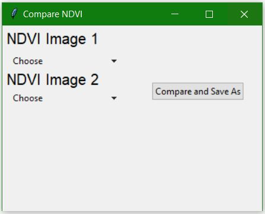

# NDVI_calculation
## Introduction
Normalized Difference Vegetation Index (NDVI) quantifies vegetation by measuring the difference between near-infrared (which vegetation strongly reflects) and red light (which vegetation absorbs). Its value ranges from -1 to 1. The formula for calculation of NDVI is: 

            

This program can be used to:
1. Crop imagery to the study area extent
2. Calculate NDVI values from landsat imagery
3. Compare the ndvi values of different periods 
4. Visualise the difference of different time periods using subplotting.

The initial user interface of this program looks as shown below: 

There are two canvas in this UI namely: Button canvas and Main Canvas, whose contents are described below: 
## Button canvas
Button canvas holds five buttons whose tasks are as follows:
1. <B>Add</B>: A user shall input the required georeferenced imageries from the local directories. Two imageries(NIR and Red band) of one time (say summer) and two of other imageries (say winter) are preferred. 

2. <B>Calculate</B>: After clicking this button, another interface appears as shown below. Please choose the input Red band and NIR band imagery in the respective section and press "calculate and Save As button " to calculate and save NDVI imagery to your desired location. 
 

3. <B>Compare</B>: For comparing the NDVI values of two time frames, first calculate the NDVI values using Calculate button for the two timespace.After you click the <B>Click</B>button  a new interface appears, where you need to choose the NDVI imagery of two periods calculated from dropdown buttons  

4. <B>Subplot</B>: A interface containing space for three inputs appears after you click <B>Sub Plot</B> button. Please choose two calculated NDVI values and the compared image from respective dropdown buttons to view the difference between NDVI values and the amount changed during the gap 
5. <B>Mask image</B>: After you click this <B>Mask Image</B> button, a new interface containing three button appears.Firstly, open the shapefile of your region of intererst using <B>Open Shape File </B> button, secondly open the georeferenced imagery using <B>Open Tif File</B> button, and then press <B>Mask and Save As</B> button to mask the imagery with the shapefile and save it to your desired local directory. 

## Main canvas
The main canvas is for holding the input image and outputs from the program. A user can click on the files to view the imagery on another window. For clear visualization of the main canvas and flow of program, a tutorial video in the 'gif format' is presented below:

